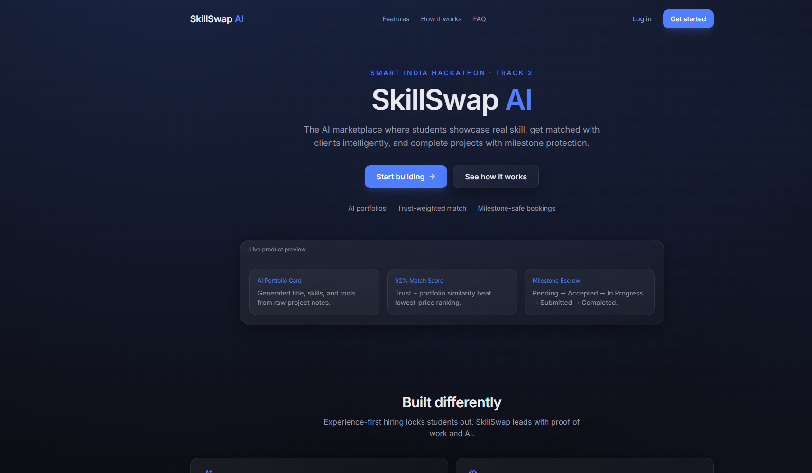
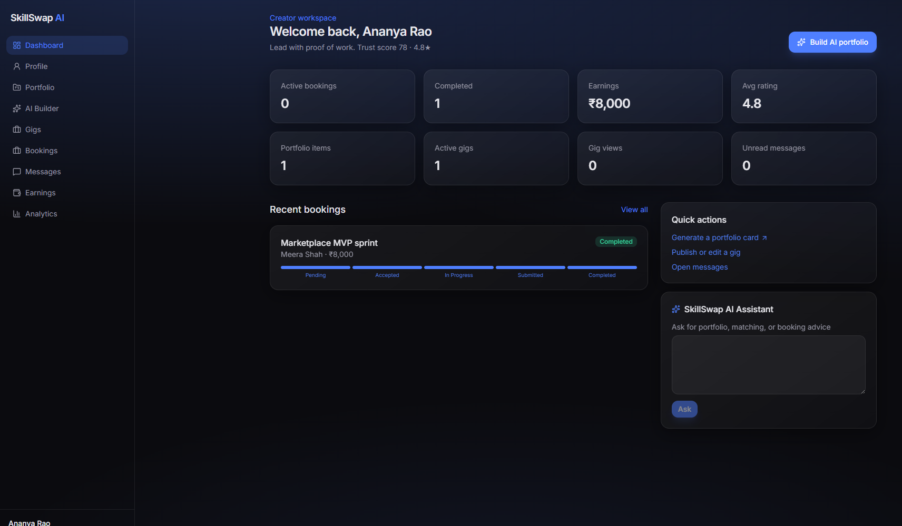
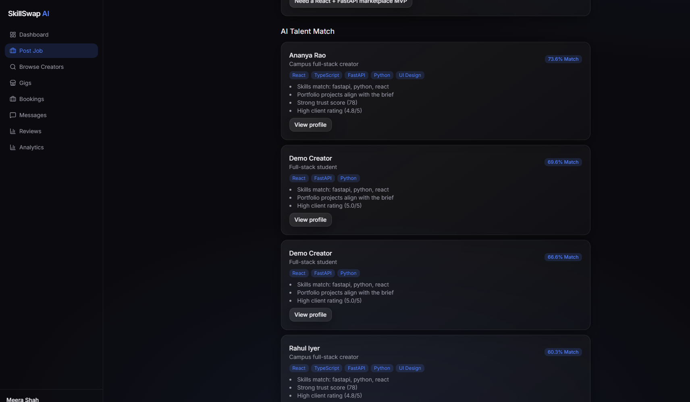

# SkillSwap AI

AI-powered marketplace for students and young creators — **not a Fiverr clone**.

Showcase skills with an AI Portfolio Builder, get matched with clients via trust-weighted talent matching, and complete work safely with milestone-based bookings.

> Smart India Hackathon · Track 2

---

## Screenshots

| Landing | Creator Dashboard | AI Match |
| --- | --- | --- |
|  |  |  |

*(Add screenshots under `docs/screenshots/` after local run.)*

---

## Architecture

```
frontend (Vite + React + TS)  →  Vercel
        │
        ▼ REST + WebSocket
backend  (FastAPI + SQLAlchemy) →  Railway
        │
        ▼
PostgreSQL (Supabase) + Cloudinary + OpenAI-compatible AI
```

### Core product pillars

1. **AI Portfolio Builder** — upload notes/image/PDF → generated title, description, skills, tools, portfolio card
2. **AI Talent Match** — job → ranked creators with compatibility score + reasons (skills, tags, experience, portfolio similarity, trust)
3. **Gig Marketplace** — CRUD gigs, browse/filter/search/save
4. **Booking workflow** — Pending → Accepted → In Progress → Submitted → Completed (+ milestones)
5. **Verified reviews** — only after completed bookings

---

## Tech stack

| Layer | Stack |
| --- | --- |
| Frontend | React 18+, Vite, TypeScript, Tailwind CSS, React Router, Framer Motion, React Query, Axios, Lucide |
| Backend | Python 3.11, FastAPI, SQLAlchemy, Alembic, Pydantic, JWT, Uvicorn |
| Database | PostgreSQL (Supabase) — SQLite supported for local bootstrap |
| Storage | Cloudinary |
| Deploy | Vercel (frontend) · Railway (backend) · Supabase (DB) |

---

## Quick start

### Prerequisites

- Node.js 20+
- Python 3.11+
- Optional: Docker, PostgreSQL, Cloudinary + AI API keys

### 1. Backend

```bash
cd backend
python -m venv .venv

# Windows
.\.venv\Scripts\activate

# macOS/Linux
source .venv/bin/activate

pip install -r requirements.txt
copy .env.example .env   # or: cp .env.example .env

# Local SQLite works out of the box via DATABASE_URL in .env
uvicorn app.main:app --reload --port 8000
```

API docs: [http://localhost:8000/docs](http://localhost:8000/docs)  
Health: [http://localhost:8000/health](http://localhost:8000/health)

### 2. Frontend

```bash
cd frontend
npm install
copy .env.example .env   # or: cp .env.example .env
npm run dev
```

App: [http://localhost:5173](http://localhost:5173)

### 3. Docker Compose (API + Postgres)

```bash
copy backend\.env.example backend\.env
# Set DATABASE_URL is overridden by compose for the backend service
docker compose up --build
```

---

## Environment variables

See `backend/.env.example` and `frontend/.env.example`.

Critical backend vars:

- `DATABASE_URL` — Supabase Postgres URI in production
- `JWT_SECRET_KEY` — strong random secret
- `AI_API_KEY` / `AI_BASE_URL` / `AI_MODEL` — OpenAI-compatible provider (optional; heuristics fall back)
- `CLOUDINARY_*` — media uploads (optional; uploads skipped if unset)
- `CORS_ORIGINS` — include your Vercel URL

---

## API overview

Base path: `/api/v1`

| Method | Path | Description |
| --- | --- | --- |
| POST | `/auth/register` | Register creator or client |
| POST | `/auth/login` | Login → access + refresh JWT |
| POST | `/auth/refresh` | Refresh tokens |
| GET | `/auth/me` | Current user |
| GET/PUT | `/creator/profile` | Creator profile |
| POST/GET | `/creator/portfolio` | AI portfolio create / list |
| GET | `/creator/dashboard` | Creator analytics snapshot |
| POST/GET/PUT/DELETE | `/gigs` | Gig marketplace |
| POST/GET | `/client/jobs` | Post / list jobs |
| GET | `/client/jobs/{id}/match` | AI talent match |
| POST/GET/PUT | `/booking` | Booking workflow |
| POST | `/review` | Verified review |
| WS | `/chat/ws?token=` | Real-time chat |
| GET | `/notifications` | In-app notifications |
| POST/GET | `/jobs` | Spec alias for client job create/list |
| POST | `/creator/portfolio/preview` | AI generate without saving |
| GET | `/gigs/mine` | Creator's own gigs |
| GET | `/review/mine` | Reviews involving the current user |

Interactive OpenAPI: `/docs`

---

## Seed demo data

```bash
cd backend
.\.venv\Scripts\activate
python scripts/seed.py
```

Demo logins (password `password123`):

- `creator@skillswap.ai`
- `creator2@skillswap.ai`
- `client@skillswap.ai`

Then run the smoke test:

```bash
python scripts/smoke_test.py
```

## Database & migrations

```bash
cd backend
alembic revision --autogenerate -m "describe_change"
alembic upgrade head
```

On startup in development, `Base.metadata.create_all` also bootstraps tables for SQLite convenience.

---

## Deployment

### Supabase PostgreSQL

1. Create a Supabase project
2. Copy the connection string into Railway `DATABASE_URL`
3. Run `alembic upgrade head` against that database

### Backend → Railway

1. Create a Railway service from `backend/`
2. Set env vars from `.env.example`
3. Deploy command: `uvicorn app.main:app --host 0.0.0.0 --port $PORT`
4. Dockerfile is provided at `backend/Dockerfile`

### Frontend → Vercel

1. Import the `frontend/` directory
2. Build: `npm run build` · Output: `dist`
3. Set `VITE_API_URL` to `https://<railway-host>/api/v1`
4. Set `VITE_WS_URL` to `wss://<railway-host>/api/v1/chat/ws`
5. `vercel.json` included for SPA rewrites

---

## Product decisions

See [DECISIONS.md](./DECISIONS.md) for why SkillSwap leads with AI portfolios, trust-weighted matching, and milestones.

---

## License

MIT — built for code2careers hackathon.
